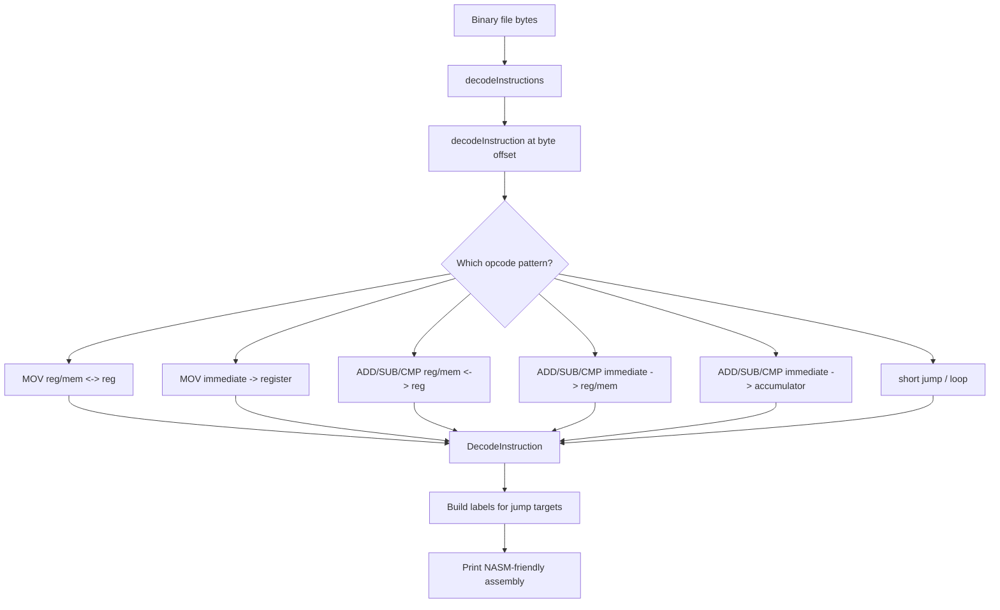
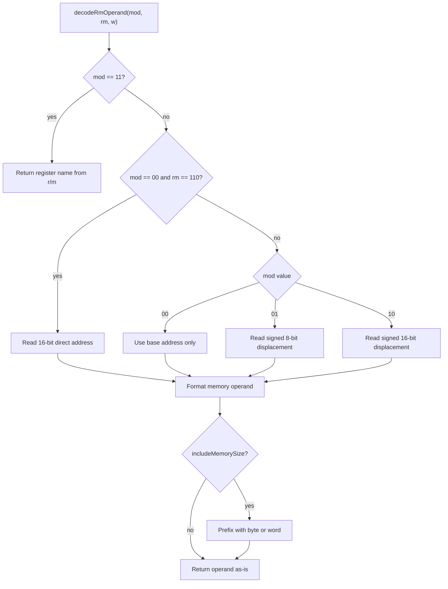
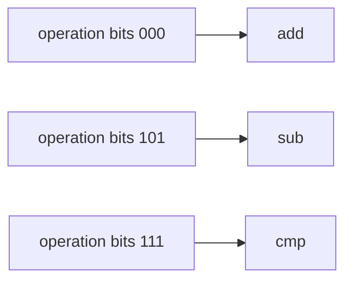
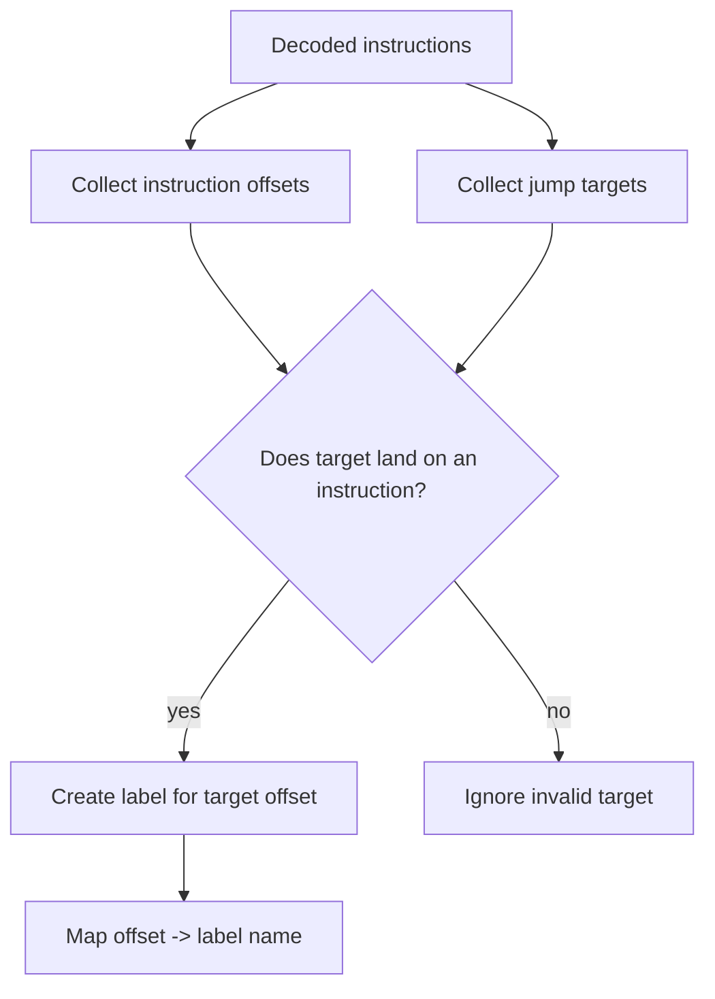

# Homework 41 Explanation: ADD, SUB, CMP, and Jumps

This note explains the goal of Homework 41, the solution strategy, and the code changes made in `src/main.cpp`.

Tone-wise, read this like a senior dev sitting next to you and saying: the CPU encoding looks noisy at first, but it is mostly a small set of repeated shapes. Once you see the shapes, the decoder becomes much less mysterious.

## The Goal Of The Homework

Before this homework, the decoder could handle a small set of `mov` instructions:

- `mov` register/memory to/from register
- `mov` immediate to register

Homework 41 asks us to expand the decoder so it can disassemble:

- `add`
- `sub`
- `cmp`
- conditional jumps like `jnz`, `je`, `jl`, etc.
- loop-style short jumps: `loop`, `loopz`, `loopnz`, `jcxz`

The important part is that `add`, `sub`, and `cmp` are not random new problems. They reuse the same 8086 instruction patterns you already learned from `mov`.

That is the main lesson.

The homework is not really saying "go memorize three new instructions." It is saying:

> Notice that 8086 has reusable encoding shapes. Build your decoder around those shapes.

## What Listing 41 Is Testing

`listing_0041.asm` is split into two big sections.

First, it tests arithmetic:

```asm
add bx, [bx+si]
add si, 2
add byte [bx], 34
add ax, 1000

sub bx, [bx+si]
sub si, 2
sub byte [bx], 34
sub ax, 1000

cmp bx, [bx+si]
cmp si, 2
cmp byte [bx], 34
cmp ax, 1000
```

Those lines are intentionally covering the major encoding forms:

- register/memory with register
- immediate with register/memory
- immediate with accumulator (`al` or `ax`)

Second, it tests short jumps:

```asm
jnz test_label1
jnz test_label0
je label
jl label
loop label
jcxz label
```

Every short jump is encoded as:

```text
opcode byte
signed 8-bit displacement
```

So the jump part is easy to decode, but slightly annoying to print if we want NASM-friendly output. More on that later.

## Big Picture Solution

The solution was to stop writing instruction-specific address decoding.

The old `mov` decoder knew how to parse the `mod reg r/m` byte internally. That worked for MOV, but Homework 41 needs the same address logic for ADD, SUB, and CMP.

So we extracted the common work into reusable helpers:

- read bytes safely
- read little-endian 16-bit values
- format signed immediates
- decode register names
- decode effective addresses
- decode the `r/m` operand

Then the instruction decoders became smaller:

- identify the instruction kind
- extract the operation bits
- call the common operand decoder
- fill out a `DecodeInstruction`

Here is the shape of the whole decoder now:



The nice part: MOV still works because it now uses the same shared `decodeRmOperand` helper instead of keeping its own copy of the addressing logic.

## Why The Existing MOV Code Was Not Enough

The old code handled this kind of instruction:

```asm
mov bx, [bp + di]
```

That instruction uses:

```text
opcode byte
mod reg r/m byte
optional displacement
```

Homework 41 adds arithmetic instructions that use the same basic operand layout:

```asm
add bx, [bp + di]
sub [bx + si], cx
cmp al, ah
```

So if we had copy-pasted the MOV decoder three times, it would have worked, but it would have made the code worse:

- same effective address table repeated
- same displacement logic repeated
- same direction bit handling repeated
- more places to fix if `[bp]`, direct addresses, or signed displacements are wrong

The better move was to make the `mod reg r/m` logic reusable.

## The Three Arithmetic Encoding Forms

For this homework, `add`, `sub`, and `cmp` appear in three forms.

### Form 1: Register/Memory With Register

This is the familiar MOV-like shape:

```text
byte 1: opcode + operation + d + w
byte 2: mod + reg + r/m
then optional displacement
```

For arithmetic instructions:

```text
00 xxx d w
```

The `xxx` bits identify the operation:

| Operation bits | Instruction |
| --- | --- |
| `000` | `add` |
| `101` | `sub` |
| `111` | `cmp` |

The `d` bit decides which operand is the destination.

| `d` | Meaning |
| --- | --- |
| `0` | destination is `r/m`, source is `reg` |
| `1` | destination is `reg`, source is `r/m` |

The `w` bit decides operand width.

| `w` | Meaning |
| --- | --- |
| `0` | 8-bit operand |
| `1` | 16-bit operand |

Example:

```asm
add bx, [bx + si]
```

Bytes:

```text
03 18
```

Breakdown:

```text
03 = 00000011
     00 000 1 1
     |  |   | |
     |  |   | +-- w = 1, 16-bit
     |  |   +---- d = 1, reg is destination
     |  +-------- operation = 000, add
     +----------- arithmetic reg/mem with register shape

18 = 00011000
     00 011 000
     |  |   |
     |  |   +---- r/m = 000, [bx + si]
     |  +-------- reg = 011, bx
     +----------- mod = 00, memory mode with no displacement
```

So the output is:

```asm
add bx, [bx + si]
```

### Form 2: Immediate To Register/Memory

This shape is:

```text
byte 1: 100000sw
byte 2: mod + operation + r/m
then optional displacement
then immediate
```

This is the one where the operation is not in the first byte. The operation is stored in the middle three bits of the second byte.

```text
byte 2: mod operation r/m
```

That middle field is often called an opcode extension.

| Operation bits | Instruction |
| --- | --- |
| `000` | `add` |
| `101` | `sub` |
| `111` | `cmp` |

The first byte starts with the same six bits for all of them:

```text
100000
```

So `add`, `sub`, and `cmp` share the same first-byte prefix in this encoding. You only know which one it is after reading the second byte.

Example:

```asm
add si, 2
```

Bytes:

```text
83 C6 02
```

Breakdown:

```text
83 = 10000011
     100000 1 1
            | |
            | +-- w = 1, destination is 16-bit
            +---- s = 1, immediate is 8-bit sign-extended

C6 = 11000110
     11 000 110
     |  |   |
     |  |   +---- r/m = 110, si when mod = 11
     |  +-------- operation = 000, add
     +----------- mod = 11, register mode

02 = immediate value 2
```

So the output is:

```asm
add si, 2
```

### Form 3: Immediate To Accumulator

The accumulator form is special-cased by the 8086 instruction set.

For these instructions, the destination is implied:

- `al` if `w = 0`
- `ax` if `w = 1`

The shape is:

```text
00 xxx 10 w
```

Again, `xxx` is the operation:

| Operation bits | Instruction |
| --- | --- |
| `000` | `add` |
| `101` | `sub` |
| `111` | `cmp` |

Examples:

```asm
add ax, 1000
add al, -30
```

These do not need a `mod reg r/m` byte because the destination is already known from the opcode.

## How The Shared R/M Decoder Works

This is the core abstraction:

```cpp
std::string decodeRmOperand(
    const std::vector<uint8_t>& bytes,
    const size_t instructionIndex,
    const uint8_t mod,
    const uint8_t rm,
    const uint8_t w,
    const bool includeMemorySize,
    size_t& instructionSize)
```

The `r/m` field means two different things depending on `mod`.

| `mod` | Meaning |
| --- | --- |
| `00` | memory mode, no displacement, except special direct-address case |
| `01` | memory mode, 8-bit displacement |
| `10` | memory mode, 16-bit displacement |
| `11` | register mode |

That last row is important.

If `mod == 11`, `r/m` does not mean memory. It means a register.

So:

```text
mod = 11
r/m = 110
w = 1
```

means:

```asm
si
```

But:

```text
mod = 00
r/m = 110
```

does not mean `[bp]`. It is the special direct-address encoding.

It means:

```asm
[some 16-bit address from the next two bytes]
```

That is why this line in listing 41:

```asm
cmp word [4834], 29
```

can be decoded correctly.

Here is the decision tree:



### Why `[bp]` Prints As `[bp + 0]`

This is a subtle but very important 8086 detail.

In 8086 addressing, `mod = 00` and `r/m = 110` does not mean `[bp]`.

It means direct address:

```asm
[4834]
```

So how does the assembler encode `[bp]`?

It has to use:

```text
mod = 01
r/m = 110
disp8 = 0
```

That literally means:

```asm
[bp + 0]
```

So when the original source says:

```asm
add bx, [bp]
```

the binary does not remember that the programmer wrote `[bp]`. It only stores the encoding that means `[bp + 0]`.

The disassembler prints:

```asm
add bx, [bp + 0]
```

That is correct and NASM-reassemblable.

This same thing keeps earlier MOV listings working too. For example:

```asm
mov dx, [bp]
```

may print as:

```asm
mov dx, [bp + 0]
```

That is still the same machine code when reassembled.

## Why Signed Formatting Was Added

Some values in the instruction stream are signed.

Examples:

```asm
add al, -30
sub al, -30
cmp al, -30
```

In the binary, `-30` is stored as an 8-bit two's-complement byte:

```text
E2
```

As an unsigned number, `E2` is `226`.

As a signed 8-bit number, `E2` is `-30`.

The decoder should print:

```asm
add al, -30
```

not:

```asm
add al, 226
```

That is why these helpers exist:

```cpp
std::string formatSigned8(const uint8_t value)
std::string formatSigned16(const uint16_t value)
```

They reinterpret the raw bytes as signed values before printing.

The same idea applies to jump displacements. Short jumps use signed 8-bit offsets, because a jump can go forward or backward.

## Why Bounds Checking Was Added

The old code read bytes like this:

```cpp
const uint8_t byte2 = bytes[index + 1];
```

That is fine as long as the input file is perfect.

But a decoder should not blindly read past the end of the file if the binary is truncated. So this helper was added:

```cpp
void ensureBytesAvailable(...)
```

Before reading a displacement, immediate, second byte, or direct address, the code checks that the bytes exist.

This gives a clean error message instead of undefined behavior.

That is the grown-up version of this decoder. Still small, but no longer casually walking off the end of the byte array.

## Code Walkthrough By Logical Blocks

Now let's walk through the code in order.

## Block 1: Includes

```cpp
#include <iostream>
#include <cstdint>
#include <fstream>
#include <map>
#include <set>
#include <stdexcept>
#include <string>
#include <vector>
```

Most of these were already needed:

- `iostream` for printing
- `cstdint` for fixed-size integer types like `uint8_t`
- `fstream` for reading the binary file
- `stdexcept` for runtime errors
- `string` and `vector` for decoded text and file bytes

Newer additions:

- `map` stores jump labels by byte offset
- `set` stores unique jump target offsets

Those are used because jumps can target the same place multiple times, and we only want one label per target.

## Block 2: `DecodeInstruction`

```cpp
struct DecodeInstruction
{
    std::string mnemonic;
    std::string destination;
    std::string source;
    size_t size = 0;
    size_t offset = 0;
    bool hasJumpTarget = false;
    int jumpTarget = 0;
};
```

This struct represents one decoded instruction.

For a normal two-operand instruction:

```asm
add bx, [bx + si]
```

we store:

```text
mnemonic    = "add"
destination = "bx"
source      = "[bx + si]"
size        = 2
offset      = byte position in the file
```

The jump fields were added for label generation:

```text
hasJumpTarget = true
jumpTarget    = byte offset that the jump lands on
```

Why store `offset`?

Because a jump does not target a source-code label in the binary. It targets a byte position. If we want to print labels, we need to know where every instruction starts.

## Block 3: File Reading

```cpp
std::vector<uint8_t> readBinaryFile(const std::string& path)
```

This function loads the entire binary file into memory.

The decoder works over raw bytes:

```text
03 18 83 C6 02 ...
```

So the file is opened with:

```cpp
std::ios::binary
```

That matters because we do not want text-mode line ending conversions. We want the exact bytes.

## Block 4: Safe Byte Reads

```cpp
void ensureBytesAvailable(...)
```

This helper protects all reads from going past the end of the file.

Example:

```cpp
ensureBytesAvailable(bytes, index, 2, "short jump");
```

means:

> Starting at `index`, I need 2 bytes available. If not, throw a useful error.

This is used before decoding:

- second instruction bytes
- 8-bit immediates
- 16-bit immediates
- 8-bit displacements
- 16-bit displacements
- jump displacements

Then we have small read helpers:

```cpp
uint16_t readU16(...)
int8_t readI8(...)
int16_t readI16(...)
```

The important one is `readU16`.

8086 stores 16-bit values in little-endian order:

```text
low byte first
high byte second
```

So:

```text
E8 03
```

means:

```text
0x03E8 = 1000
```

The code reconstructs that with:

```cpp
lowByte | (highByte << 8)
```

## Block 5: Formatting Signed Values

```cpp
std::string formatSigned8(const uint8_t value)
std::string formatSigned16(const uint16_t value)
```

These are used when the assembly should display signed values.

Important example:

```text
E2
```

As unsigned:

```text
226
```

As signed 8-bit:

```text
-30
```

The listing expects:

```asm
add al, -30
```

So the decoder intentionally casts through `int8_t`.

For 16-bit values, the same idea applies with `int16_t`.

## Block 6: Formatting Displacements

```cpp
std::string formatDisplacement(const int displacement)
```

Effective addresses can have positive or negative displacements:

```asm
[bx + si + 4]
[bp + di - 8]
```

The helper formats the sign explicitly:

```text
 + 4
 - 8
```

That makes address strings easy to build:

```cpp
"[" + getEffectiveAddressBase(rm) + formatDisplacement(displacement) + "]"
```

## Block 7: Register Names

```cpp
const char* getRegisterName(const uint8_t regCode, const uint8_t w)
```

8086 register fields are three bits wide.

The same three-bit code can mean an 8-bit register or a 16-bit register depending on `w`.

| Code | `w = 0` | `w = 1` |
| --- | --- | --- |
| `000` | `al` | `ax` |
| `001` | `cl` | `cx` |
| `010` | `dl` | `dx` |
| `011` | `bl` | `bx` |
| `100` | `ah` | `sp` |
| `101` | `ch` | `bp` |
| `110` | `dh` | `si` |
| `111` | `bh` | `di` |

That table is used for both:

- the `reg` field
- the `r/m` field when `mod == 11`

## Block 8: Effective Address Bases

```cpp
std::string getEffectiveAddressBase(const uint8_t rm)
```

When `mod` says the operand is memory, the `r/m` field chooses the address calculation.

| `r/m` | Effective address |
| --- | --- |
| `000` | `bx + si` |
| `001` | `bx + di` |
| `010` | `bp + si` |
| `011` | `bp + di` |
| `100` | `si` |
| `101` | `di` |
| `110` | `bp` or direct address special case |
| `111` | `bx` |

This is shared by MOV and the arithmetic instructions.

## Block 9: `decodeRmOperand`

This is one of the most important changes.

```cpp
std::string decodeRmOperand(...)
```

It takes:

- the byte array
- the instruction start offset
- `mod`
- `rm`
- `w`
- whether to include `byte` or `word`
- a reference to `instructionSize`

Why does it update `instructionSize`?

Because decoding the `r/m` operand may consume more bytes.

Examples:

```asm
[bx + si]
```

No displacement:

```text
instruction size unchanged
```

```asm
[bx + si + 4]
```

8-bit displacement:

```text
instruction size += 1
```

```asm
[bp + si + 1000]
```

16-bit displacement:

```text
instruction size += 2
```

```asm
[4834]
```

direct address:

```text
instruction size += 2
```

That is why `instructionSize` is passed by reference.

The caller starts with the bytes it already consumed. For a `mod reg r/m` instruction, that is usually:

```cpp
size_t instructionSize = 2;
```

Then `decodeRmOperand` adds any displacement bytes it consumes.

### The `includeMemorySize` Flag

Sometimes NASM needs a memory size:

```asm
add byte [bx], 34
add word [bp + si + 1000], 29
```

Why?

Because the source is an immediate. The immediate alone does not fully tell NASM whether the memory destination is byte-sized or word-sized.

So for immediate-to-memory arithmetic, we pass:

```cpp
includeMemorySize = true
```

For register/memory with register, we pass:

```cpp
includeMemorySize = false
```

Because the register already tells NASM the size:

```asm
add [bx + si], bx
```

`bx` makes it obvious this is word-sized.

## Block 10: Existing MOV Register/Memory Decoder

```cpp
bool isMovRegisterMemoryToFromRegister(const uint8_t byte1)
```

This still identifies the MOV encoding:

```text
100010dw
```

The MOV decoder still extracts:

```cpp
const uint8_t d = (byte1 >> 1) & 0b1;
const uint8_t w = byte1 & 0b1;

const uint8_t mod = (byte2 >> 6) & 0b11;
const uint8_t reg = (byte2 >> 3) & 0b111;
const uint8_t rm = byte2 & 0b111;
```

The change is that MOV now calls:

```cpp
decodeRmOperand(...)
```

That means MOV benefits from the same fixed addressing behavior as ADD/SUB/CMP.

This is how earlier MOV listings keep working.

The important compatibility point:

```asm
mov dx, [bp]
```

can print as:

```asm
mov dx, [bp + 0]
```

That is still correct because the machine code cannot distinguish original source spelling.

## Block 11: MOV Immediate To Register

```cpp
bool isMovImmediateToRegister(const uint8_t byte1)
```

This handles:

```text
1011wreg
```

Examples:

```asm
mov cl, 12
mov cx, -12
```

This code mostly stayed conceptually the same.

The main improvement is that it now uses the signed formatting helpers:

```cpp
result.source = formatSigned8(bytes[index + 1]);
result.source = formatSigned16(immediate);
```

That lets earlier listings print negative immediates correctly:

```asm
mov ch, -12
mov cx, -12
mov dx, -3948
```

## Block 12: Arithmetic Mnemonic Lookup

```cpp
const char* getArithmeticMnemonic(const uint8_t operation)
```

This maps the three operation bits to the instruction name.

```cpp
case 0b000: return "add";
case 0b101: return "sub";
case 0b111: return "cmp";
```

This function is small, but it is the conceptual center of the homework.

The operation bits mean the same thing in multiple encoding forms.



The only thing that changes is where those bits live.

| Encoding form | Where operation bits live |
| --- | --- |
| register/memory with register | first byte, bits 5..3 |
| immediate to register/memory | second byte, bits 5..3 |
| immediate to accumulator | first byte, bits 5..3 |

That is the trick the homework wants you to see.

## Block 13: Arithmetic Register/Memory With Register

```cpp
bool isArithmeticRegisterMemoryToFromRegister(const uint8_t byte1)
```

This recognizes bytes matching:

```text
00 xxx d w
```

The code:

```cpp
const uint8_t operation = (byte1 >> 3) & 0b111;

return ((byte1 & 0b11000100) == 0b00000000) &&
       (getArithmeticMnemonic(operation) != nullptr);
```

The mask checks the fixed bits.

```text
byte:  00 xxx d w
mask:  11 000 1 0
want:  00 000 0 0
```

The operation bits are allowed to vary, but only if they map to one of the homework instructions.

Then:

```cpp
DecodeInstruction decodeArithmeticRegisterMemoryToFromRegister(...)
```

does the same kind of operand work as MOV:

1. read byte 1 and byte 2
2. extract operation, `d`, `w`, `mod`, `reg`, `rm`
3. map operation to `add`, `sub`, or `cmp`
4. decode the `reg` operand
5. decode the `r/m` operand
6. use `d` to decide destination/source order

This decodes examples like:

```asm
add bx, [bx + si]
sub [bp + di + 6], di
cmp al, ah
```

## Block 14: Arithmetic Immediate To Register/Memory

```cpp
bool isArithmeticImmediateToRegisterMemory(const uint8_t byte1)
```

This recognizes:

```text
100000sw
```

The code checks:

```cpp
return (byte1 >> 2) == 0b100000;
```

That ignores the last two bits, `s` and `w`, because they are variable.

Then:

```cpp
DecodeInstruction decodeArithmeticImmediateToRegisterMemory(...)
```

extracts:

```cpp
const uint8_t s = (byte1 >> 1) & 0b1;
const uint8_t w = byte1 & 0b1;

const uint8_t mod = (byte2 >> 6) & 0b11;
const uint8_t operation = (byte2 >> 3) & 0b111;
const uint8_t rm = byte2 & 0b111;
```

Notice: in this encoding, the second byte's middle bits are not a register.

They are the operation.

That is the opcode extension:

```text
mod operation r/m
```

Then the destination is decoded from `mod` and `r/m`:

```cpp
const bool includeMemorySize = true;
const std::string destination = decodeRmOperand(...);
```

The `includeMemorySize` flag matters for lines like:

```asm
add byte [bx], 34
sub word [bx + di], 29
cmp word [4834], 29
```

### Understanding `s` And `w`

The `w` bit still means destination width:

| `w` | Destination width |
| --- | --- |
| `0` | byte |
| `1` | word |

The `s` bit means:

| `s` | Immediate behavior |
| --- | --- |
| `0` | immediate has full width |
| `1` | 8-bit immediate sign-extended to word |

So:

```asm
add si, 2
```

can use a one-byte immediate even though `si` is 16-bit.

The bytes are:

```text
83 C6 02
```

`83` means:

```text
10000011
      s=1
        w=1
```

So the destination is word-sized, but the immediate is only one byte and gets sign-extended by the CPU.

For printing, we simply print the signed immediate:

```asm
add si, 2
```

## Block 15: Arithmetic Immediate To Accumulator

```cpp
bool isArithmeticImmediateToAccumulator(const uint8_t byte1)
```

This recognizes:

```text
00 xxx 10 w
```

The mask checks fixed bits:

```cpp
return ((byte1 & 0b11000110) == 0b00000100) &&
       (getArithmeticMnemonic(operation) != nullptr);
```

The decoder:

```cpp
DecodeInstruction decodeArithmeticImmediateToAccumulator(...)
```

does not read a `mod reg r/m` byte.

Why?

Because the destination is implied:

```cpp
result.destination = (w == 0) ? "al" : "ax";
```

Then it reads:

- 1 immediate byte if `w == 0`
- 2 immediate bytes if `w == 1`

This decodes:

```asm
add ax, 1000
add al, -30
sub ax, 1000
cmp al, 9
```

## Block 16: Jump Mnemonic Lookup

```cpp
const char* getJumpMnemonic(const uint8_t byte1)
```

This maps exact opcode bytes to jump mnemonics.

Examples:

| Opcode | Mnemonic |
| --- | --- |
| `0x74` | `je` |
| `0x75` | `jnz` |
| `0x7C` | `jl` |
| `0x7E` | `jle` |
| `0xE2` | `loop` |
| `0xE3` | `jcxz` |

Conditional jumps do not need fancy bit extraction for this homework. We can just table-map the opcode byte.

```cpp
bool isJump(const uint8_t byte1)
{
    return getJumpMnemonic(byte1) != nullptr;
}
```

This makes the dispatch code clean.

## Block 17: Decoding A Jump

```cpp
DecodeInstruction decodeJump(...)
```

Short jumps are two bytes:

```text
opcode displacement
```

The displacement is signed and relative to the end of the instruction.

That means the target is:

```cpp
current instruction offset + instruction size + displacement
```

The code:

```cpp
result.jumpTarget =
    static_cast<int>(index) +
    static_cast<int>(result.size) +
    static_cast<int>(displacement);
```

Example:

```text
offset 0xC7: 75 02
```

`75` is `jnz`.

`02` means jump forward 2 bytes from the end of this instruction.

The instruction itself is 2 bytes, so:

```text
target = 0xC7 + 2 + 2
target = 0xCB
```

That target is another instruction offset.

## Block 18: Why We Generate Labels

The simplest possible disassembler could print:

```asm
jnz 2
jnz -4
```

That proves we decoded the jump displacement.

But NASM does not conveniently reassemble conditional jumps written with raw relative numbers. NASM wants labels.

So we generate our own labels:

```asm
label0:
jnz label1
jnz label0

label1:
jnz label0
jnz label1
```

The original label names are gone from the binary.

The binary only contains:

```text
opcode
signed displacement
```

So we cannot recover names like:

```asm
test_label0
test_label1
```

But we can produce new labels that point to the same byte offsets.

That is enough for correct reassembly.

## Block 19: Decoding One Instruction

```cpp
DecodeInstruction decodeInstruction(...)
```

This is the dispatcher.

It looks at the first byte and asks:

```cpp
if (isMovRegisterMemoryToFromRegister(byte1))
else if (isMovImmediateToRegister(byte1))
else if (isArithmeticRegisterMemoryToFromRegister(byte1))
else if (isArithmeticImmediateToRegisterMemory(byte1))
else if (isArithmeticImmediateToAccumulator(byte1))
else if (isJump(byte1))
else throw
```

The order matters a little because some patterns can look similar. We check the known MOV patterns first, then arithmetic patterns, then jumps.

At the end:

```cpp
instruction.offset = index;
```

That records where the instruction started in the file.

The label pass needs that later.

## Block 20: Decoding The Whole File

```cpp
std::vector<DecodeInstruction> decodeInstructions(...)
```

This walks through the full byte array:

```cpp
for (size_t i = 0; i < bytes.size();)
{
    DecodeInstruction instruction = decodeInstruction(bytes, i);
    i += instruction.size;
    instructions.push_back(instruction);
}
```

This is the standard decoder loop:

1. decode instruction at current byte offset
2. learn how big it was
3. move forward by that size
4. repeat

The instruction itself tells us how many bytes to skip.

That is why every decoder must set `result.size` correctly.

## Block 21: Building Jump Labels

```cpp
std::map<size_t, std::string> buildJumpLabels(...)
```

This function does a second pass after decoding.

Why second pass?

Because to print labels, we need to know all instruction offsets first.

The function first collects every instruction start:

```cpp
std::set<size_t> instructionOffsets;
```

Then it walks every decoded instruction and finds jump targets:

```cpp
if (instruction.hasJumpTarget)
```

If the target is valid and lands on an instruction boundary, it records it:

```cpp
targetOffsets.insert(targetOffset);
```

Finally it assigns names:

```cpp
label0
label1
label2
```

Here is the label pass visually:



## Block 22: Applying Jump Labels

```cpp
void applyJumpLabels(...)
```

When `decodeJump` first runs, it stores the destination as a plain number:

```cpp
result.destination = std::to_string(displacement);
```

That is useful as a fallback.

After labels are built, `applyJumpLabels` replaces the destination text:

```cpp
instruction.destination = label->second;
```

So:

```asm
jnz -4
```

becomes:

```asm
jnz label0
```

Again, this is not because the original binary had `label0`. It did not. This is just a clean generated name for the target byte offset.

## Block 23: Printing Instructions

```cpp
void printInstruction(const DecodeInstruction& instruction)
```

This prints:

```asm
mnemonic destination, source
```

But jumps only have one operand:

```asm
jnz label0
```

So the printer checks whether `source` is empty.

That keeps the printing generic enough for both:

```asm
add bx, [bx + si]
```

and:

```asm
jnz label0
```

## Block 24: `decodeFile`

```cpp
void decodeFile(const std::string& path)
```

This is now the orchestration function:

```cpp
const std::vector<uint8_t> bytes = readBinaryFile(path);
std::vector<DecodeInstruction> instructions = decodeInstructions(bytes);
const std::map<size_t, std::string> labels = buildJumpLabels(instructions, bytes.size());
applyJumpLabels(instructions, labels);
```

The order matters:

1. read the binary
2. decode all instructions
3. build labels from jump targets
4. replace jump destinations with label names
5. print everything

Then it prints the NASM header:

```asm
bits 16
```

For each instruction, it checks whether a label belongs before that instruction:

```cpp
const auto label = labels.find(instruction.offset);
```

If yes, it prints:

```asm
label0:
```

then prints the instruction.

## Block 25: `main`

```cpp
int main(int argc, char** argv)
```

This part stayed simple.

The program expects one argument:

```text
the path to the binary file to decode
```

Example:

```powershell
.\cmake-build-debug\sim8086.exe .\data\listing_0041
```

If no file is provided, it prints:

```text
Usage: sim8086 <binary-file>
```

That is what happened when you ran:

```powershell
.\sim8086.exe
```

No argument means the decoder has no input file.

## Why Earlier MOV Homework Still Works

The earlier MOV functionality is preserved because:

1. The MOV detection functions are still there.
2. `decodeMovRegisterMemoryToFromRegister` still handles `100010dw`.
3. `decodeMovImmediateToRegister` still handles `1011wreg`.
4. MOV now uses the shared `decodeRmOperand` helper.
5. Signed immediate printing was improved, which helps MOV output too.

The big behavioral difference is formatting:

```asm
mov dx, [bp]
```

may print as:

```asm
mov dx, [bp + 0]
```

That is correct.

The byte round-trip confirms it:

```text
listing_0039 bytes match
```

So even if the text does not exactly match the original source spelling, it assembles back to the same machine code.

That is the real test of a disassembler for these homeworks.

## How To Test The Homework

From the project root:

```powershell
cd "E:\ComputerEnhance\ComputerEnhanceHomework\01 - Reading ASM\sim8086"
```

Assemble the homework listing into a raw binary:

```powershell
nasm -f bin .\data\listing_0041.asm -o .\data\listing_0041
```

Run the decoder:

```powershell
.\cmake-build-debug\sim8086.exe .\data\listing_0041
```

If you are inside `cmake-build-debug`, use `..\data\listing_0041`:

```powershell
.\sim8086.exe ..\data\listing_0041
```

Because relative paths are resolved from the terminal's current directory, not from wherever you wish the file was. Classic terminal lesson, annoying but useful.

## How To Round-Trip Test

The strong test is:

1. Assemble original `.asm` to binary.
2. Disassemble binary with our program.
3. Assemble our generated `.asm` back to binary.
4. Compare both binaries byte-for-byte.

PowerShell version:

```powershell
nasm -f bin .\data\listing_0041.asm -o .\data\listing_0041

.\cmake-build-debug\sim8086.exe .\data\listing_0041 > .\out_listing_0041.asm

nasm -f bin .\out_listing_0041.asm -o .\out_listing_0041

fc /b .\data\listing_0041 .\out_listing_0041
```

If the bytes match, the output is semantically correct for this homework.

This is better than comparing text against the original source, because source code can spell the same machine code in different ways:

```asm
[bp]
[bp + 0]
```

Those can assemble to the same bytes.

## Mental Model To Keep

The clean way to think about this decoder is:


For Homework 41, the big unlock is this:

```text
ADD, SUB, and CMP are the same decoder problem with different operation bits.
```

The operation bits are:

```text
000 = add
101 = sub
111 = cmp
```

The rest is mostly machinery:

- `d` decides operand direction
- `w` decides byte vs word
- `s` decides whether an immediate is sign-extended
- `mod` decides register vs memory mode
- `reg` is either a register or part of the operation, depending on the encoding
- `r/m` is either a register or an effective address, depending on `mod`

Once that clicks, the code stops feeling like a pile of bit twiddling and starts looking like a small parser.

That is exactly what it is.
